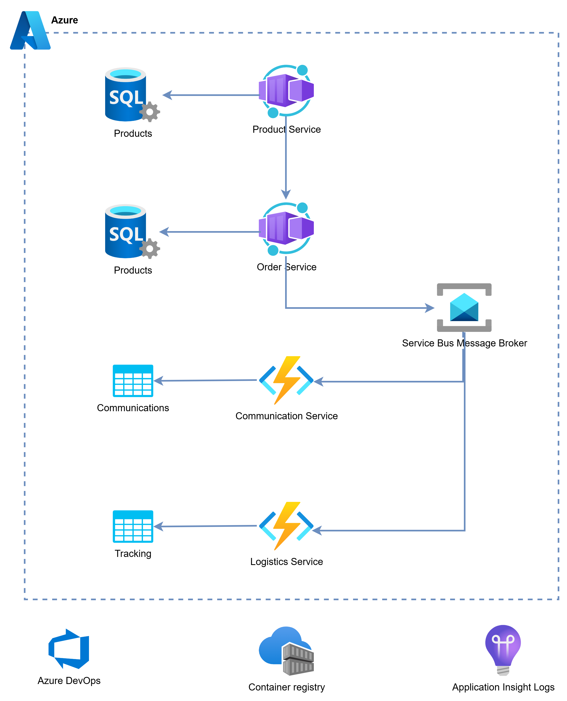

## Objective
Design and implement an order management system.
- Should include basic order management flow
- The system should leverage Domain-Driven Design (DDD), Microservices Architecture, Event-Driven Architecture (EDA), and Azure Services.

## Requirements

1. **Order Processing**
    - Implement order creation, including the application of valid promo codes.
    - Calculate discounts and update order totals accordingly.

1. **Promo Code Management**
    - Create a service to manage promo codes, including creation, validation, and expiration.
    - Ensure promo codes can be applied to orders to provide discounts.

1. **Communication Service**
    - Implement a service to send messages to users.
    - Send order confirmation messages to users after order creation.

1. **Logistics Service**
    - Implement a service to manage order fulfillment and delivery.
    - Update order status and notify users when orders are shipped.

1. **Product Catalog**
    - Implement a service to manage products.
    - Provide product information to the order service.

## Architecture

### Components
1. SQL Databases
1. Azure Container Apps
1. Azure Functions
1. Azure Service Bus
1. Azure Storage tables
1. Application Insights
1. Container Registry
1. Azure DevOps

## Steps

### Identify the domains
Identify the domains and subdomains. Create a context map to show the relationships between the domains.

### Create Product Management Service
- Create an ASP.NET Core API to manage products.
  - Create/update/delete products
  - Basic properties: Id, Name, Description, Price
- Use EF Core to store product data in a SQL database.
- The API should contain the following
    - GET /api/products
    - GET /api/products/{id}
    - POST /api/products
    - PUT /api/products/{id}
    - DELETE /api/products/{id}
- Implement Swagger for API documentation.
- Implement versioning for the API.
- Implement validation for the API.
- Implement logging for the API.
- Have 3 layers: API, Domain & Services, Data
- Deploy the API to Azure container Apps
- Deploy Db in Azure